[](https://dev.azure.com/dnikolovv/solution-snapshotter/_build/latest?definitionId=4&branchName=master)

# solution-snapshotter

Take a snapshot of your current solution and instantly export it as a Visual Studio extension!

## Snapshot?

In the context of this project, a snapshot means an exported Visual Studio template that represents your current project's state.

If you have your project setup ready ([like this, for example](https://github.com/dnikolovv/devadventures-net-core-template/tree/master/source)), you can use this tool to export a ready-to-install Visual Studio extension instantly. The generated extension will contain a template that will initialize your project as you imported it.

You can also read my [DotNetCurry article](https://www.dotnetcurry.com/visual-studio/1521/visual-studio-project-setup-solution-snapshotter) on why this tool was made and what problems does it solve.

## Table of contents

1. [What this tool does in pictures](#what-this-tool-does-in-pictures)
2. [Requirements](#requirements)
3. [Assumptions made](#assumption)
4. [An example project that uses this tool](#an-example-project-that-uses-it)
5. [What you can use it for](#what-you-could-use-it-for)
6. [Usage](#usage)
7. [Minimal usage](#minimal-usage)
8. [Contributing](#contributing)

## What this tool does in pictures

Given a project setup that you've put together:

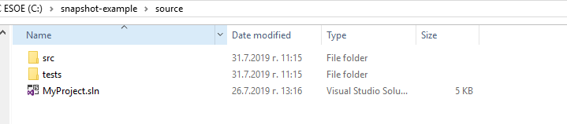

Call `solution-snapshotter.exe`:

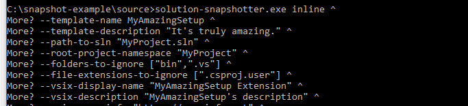
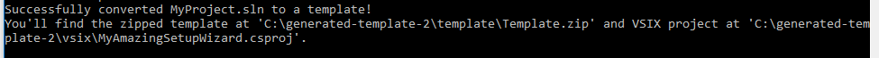

And receive a generated Visual Studio extension (VSIX) project:

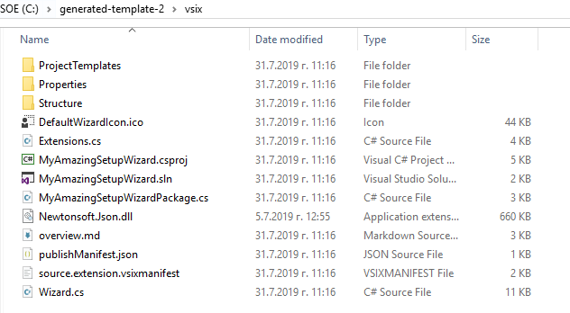

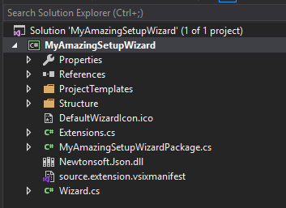

You can build it (or your CI agent):

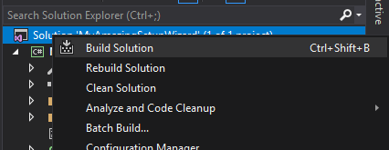

And install it to Visual Studio (or ship it to the VS marketplace):

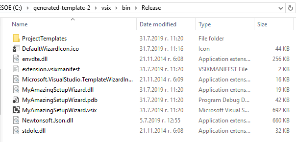
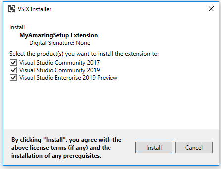

After installing, your template will be available in Visual Studio under the name you've given it:

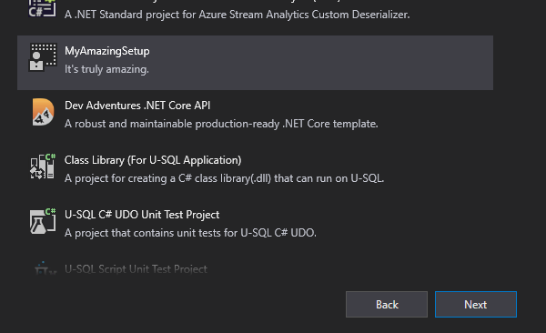
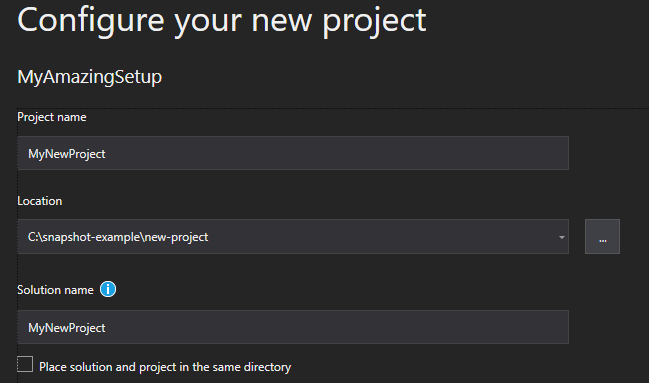

The projects that you create will have the same physical and solution structure as your initial "source":


With any extra folders and files included (these could also be docker compose configuration files, for example):

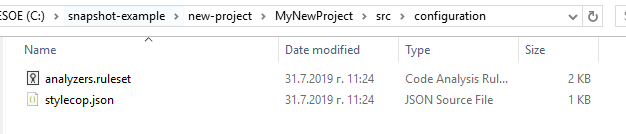

And all references being valid (given that your source project was in a good state):

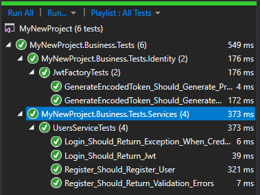

## Requirements

In order to build the generated VSIX (Visual Studio extension) project, you will need to have installed the `Visual Studio extension development` toolkit using the `Visual Studio Installer`.

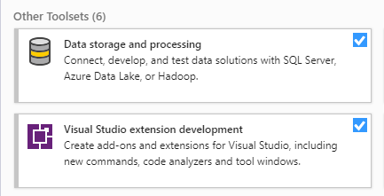

## Assumption

The tool makes one major assumption - your `.sln` file only references projects that are further down in the folder hierarchy.

If it references project files in folders above in the hierarchy, don't expect it to work properly. Also, don't expect a proper template if you have your solution on the same level as the `.csproj` or `.fsproj` files.

You may actually get a decent result, but these are not scenarios I've considered supporting.

Example supported structures:

```
├───client (some JS app, for example)
├───src
|   ├───MyProject.Api
|   ├───MyProject.Business
|   ├───MyProject.Core
|   ├───MyProject.Data
└───MyProject.sln
```

```
├───MyProject.Api
├───MyProject.Business
├───MyProject.Core
├───MyProject.Data
├───MyProject.sln
```

An example unsupported structure:

```
├───core
|   └───MyProject.Core (referenced by MyProject.sln)
├───project
|   ├───MyProject.sln
│   ├───MyProject.Api
│   ├───MyProject.Business
│   ├───MyProject.Core
│   └───MyProject.Data
```

## An example project that uses it

The [Dev Adventures .NET Core project setup](https://marketplace.visualstudio.com/items?itemName=dnikolovv.dev-adventures-project-setup&ssr=false#overview) is generated using this tool.

The initial source is contained in [this GitHub repository](https://github.com/dnikolovv/devadventures-net-core-template/tree/master/source).

On commits to `master`, the CI kicks in and uses `solution-snapshotter` to generate a `.vsix` file that is then automatically published to the VS Marketplace. You can see the extension page [here](https://marketplace.visualstudio.com/items?itemName=dnikolovv.dev-adventures-project-setup).


## What you could use it for

If you work for a service company, use this tool to create and maintain standard templates for different project types.

If you're doing microservices, use it to create common templates for services or shared libraries.

Basically, every time you think a template would be handy.

## Usage

`solution-snapshotter` supports two ways of providing arguments - inline or through a config file.

```console
> solution-snapshotter.exe --help

USAGE: solution-snapshotter.exe [--help] [from-file <filePath>] [<subcommand> [<options>]]

SUBCOMMANDS:

    inline <options>      Provide the arguments inline (as CLI arguments).

    Use 'solution-snapshotter.exe <subcommand> --help' for additional information.

OPTIONS:

    from-file <filePath>  Provide a .config file that holds the arguments.
    --help                display this list of options.
```

You can view the CLI documentation using the `--help` argument. Optional arguments are wrapped in square brackets.

```console
> solution-snapshotter.exe inline --help

USAGE: solution-snapshotter.exe inline [--help] --template-name <name> --template-description <description> --template-wizard-assembly <assemblyName> --root-project-namespace <namespace> --path-to-sln <path> --vsix-version <version>
                                       --vsix-publisher-full-name <publisher> --vsix-publisher-username <publisher> --vsix-display-name <displayName> --vsix-description <description> --vsix-more-info <info>
                                       --vsix-getting-started <gettingStarted> --vsix-overview-md-path <path> --vsix-price-category <free|trial|paid> --vsix-qna-enable <qnaEnabled> --vsix-internal-name <name> [--vsix-repo=<repo>]
                                       [--vsix-custom-icon=<iconPath>] [--vsix-custom-package-guid=<guid>] [--vsix-custom-project-guid=<guid>] [--vsix-custom-id=<id>] [--custom-template-icon=<iconPath>] [--destination=<destination>]
                                       [--vsix-tags=<tags>] [--vsix-categories [<categories>...]] [--folders-to-ignore [<folderNames>...]] [--file-extensions-to-ignore [<extensions>...]]

OPTIONS:

    --template-name <name>
                          Sets the name of the template. This will be shown in Visual Studio.
    --template-description <description>
                          Sets the description of the template. This will be shown in Visual Studio.
    --template-wizard-assembly <assemblyName>
                          Sets the name of the generated VSIX assembly.
    --root-project-namespace <namespace>
                          Sets the project root namespace (e.g. MyProject).
    --path-to-sln <path>  Sets the path to the source project .sln file.
    --vsix-version <version>
                          Sets the version of the generated VSIX assembly.
    --vsix-publisher-full-name <publisher>
                          The publisher's full name on the marketplace (e.g. John Smith).
    --vsix-publisher-username <publisher>
                          The publisher's username on the marketplace (e.g. jsmith12).
    --vsix-display-name <displayName>
                          Sets the display name of the generated VSIX assembly.
    --vsix-description <description>
                          Sets the description of the generated VSIX assembly.
    --vsix-more-info <info>
                          Sets the 'More Info' tag of the generated VSIX assembly.
    --vsix-getting-started <gettingStarted>
                          Sets the 'Getting Started' tag of the generated VSIX assembly.
    --vsix-overview-md-path <path>
                          The path to the overview.md file that will be shown in the marketplace.
    --vsix-price-category <free|trial|paid>
                          The price category of the extension.
    --vsix-qna-enable <qnaEnabled>
                          Whether or not your extension should have a Q&A section.
    --vsix-internal-name <name>
                          The extension's marketplace internal name.
    --vsix-repo=<repo>    The repository url for the extension.
    --vsix-custom-icon=<iconPath>
                          Sets a custom icon for the VSIX. This appears in the Extensions tab.
    --vsix-custom-package-guid=<guid>
                          Optionally sets a custom package GUID for the generated VSIX assembly.
    --vsix-custom-project-guid=<guid>
                          Optionally sets a custom project GUID for the generated VSIX assembly.
    --vsix-custom-id=<id> Optionally sets a custom id for the generated VSIX assembly.
    --custom-template-icon=<iconPath>
                          Optionally sets a custom template icon.
    --destination=<destination>
                          Sets a custom destination folder.
    --vsix-tags=<tags>    The tags for the VSIX.
    --vsix-categories [<categories>...]
                          The categories for the VSIX in the marketplace.
    --folders-to-ignore [<folderNames>...]
                          Which folders in the source project folder to ignore (e.g. bin, obj, lib, etc.)
    --file-extensions-to-ignore [<extensions>...]
                          Which file extensions in the source folder to ignore (e.g. .min.js)
    --help                display this list of options.
```

When supplying a `.config` file, use the same argument names, but instead of dashes, use spaces for the key values.

Example:

```xml
<?xml version="1.0" encoding="utf-8" ?>
<configuration>
  <appSettings>
    <add key="path to sln" value=".\sample-app\MyProject.sln" />
    <add key="root project namespace" value="MyProject" />
    <add key="template name" value="A random template" />
    <add key="template description" value="Just testing stuff..." />
    <add key="custom template icon" value=".\template-icon.ico" />
    <add key="destination" value="template" />
    <add key="vsix custom icon" value="logo-only.png" />
    <add key="vsix version" value="0.1" />
    <add key="vsix publisher full name" value="John Smith" />
    <add key="vsix publisher username" value="jsmith12" />
    <add key="vsix display name" value="An irrelevant extension" />
    <add key="vsix description" value="It's an example" />
    <add key="template wizard assembly" value="SomeRandomWizard" />
    <add key="vsix more info" value="https://moreinfo.net" />
    <add key="folders to ignore" value="bin packages obj lib .git .vs node_modules" />
    <add key="vsix getting started" value="https://github.com/dnikolovv" />
    <add key="vsix repo" value="https://github.com/dnikolovv" />
    <add key="vsix qna enable" value="true" />
    <add key="vsix price category" value="free" />
    <add key="vsix internal name" value="unique-internal-name" />
    <add key="vsix categories" value="visual studio extensions,other templates" />
    <add key="vsix overview md path" value="overview.md" />
    <add key="file extensions to ignore" value=".min.js" />
    <add key="vsix tags" value="template,generation" />
  </appSettings>
</configuration>
```

```console
> solution-snapshotter.exe from-file input.config

Successfully converted <YourProject>.sln to a template!
You'll find the zipped template at 'C:\some-path\Template.zip' and VSIX project at 'C:\some-path\SomeRandomWizard.csproj'.
```

## Minimal usage

If you want to get started quickly, simply download the latest **.exe** from the [releases page](https://github.com/dnikolovv/solution-snapshotter/releases), copy the following command and adjust the `path-to-sln`, `root-project-namespace` and `vsix-overview-md-path` parameters. The `overview.md` can be an empty **.md** file. Also, make sure to exclude the **.vs** folder.

> Note: Don't expect to know what each parameter means if you're not familiar with the VSIX project type. Most of the parameters can and **will** be made optional in a future release.

The `^` signs serve as newline characters in Windows's `cmd`. Remove them if you are not using it.

```console
> solution-snapshotter.exe inline ^ 
--template-name MyAmazingSetup --template-description "It's truly amazing." ^ 
--path-to-sln "MyProject.sln" --root-project-namespace "MyProject" --folders-to-ignore "bin" ".vs" ^ 
--file-extensions-to-ignore ".csproj.user" --vsix-display-name "MyAmazingSetup Extension" ^ 
--vsix-description "MyAmazingSetup's description" --vsix-more-info "https://moreinfo.net" ^ 
--vsix-getting-started "https://gettingstarted.net" --vsix-price-category free --vsix-qna-enable true ^ 
--vsix-categories "other templates" --vsix-internal-name a-unique-internal-name ^ 
--vsix-overview-md-path "..\overview.md" --template-wizard-assembly "MyAmazingSetupWizard" ^ 
--vsix-version 1.0 --vsix-publisher-full-name "John Smith" --vsix-publisher-username "random-publisher"
```

You'll find your Visual Studio extension project under `C:\generated-template\vsix`.

Note that to build the generated project you will need to have installed the `Visual Studio extension development` kit using the `Visual Studio Installer`.


There are two ways to test your template.

1. Open the VSIX project inside Visual Studio and hit `Ctrl + F5` to open an experimental VS instance you can test in.
2. Build the project and install the generated `.vsix` file to your VS instance.

## Contributing

Contributions are welcome. Also, don't hesitate to [open an issue](https://github.com/dnikolovv/solution-snapshotter/issues) if there's anything you think could be improved.

## License

This project is licensed under the MIT License.
